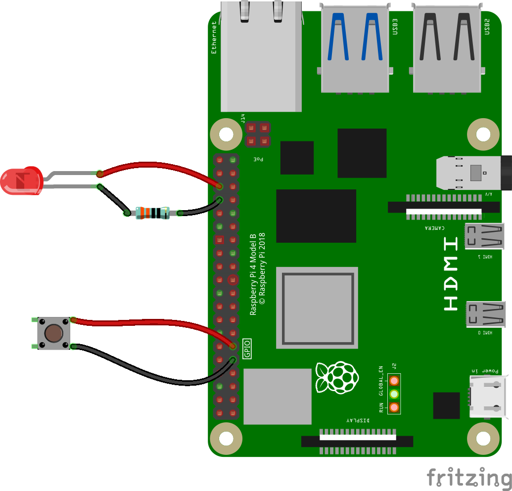

# Raspberry Pi Video Looper VLC
A Bash Video Looper for the Raspberry Pi 4 and a Python3 shutdown button and LED indicator

To install either clone this repo to a Raspberry Pi with wifi setup on it and run setup.sh as root, or run this command:

    curl -L https://bit.ly/pi_vid_looper_VLC | sudo bash

N.B. It is generally not a good idea to pipe the output of a shortened URL straight into a root shell; but follow the link first and you will see it takes you to the setup.sh file and processes that for you!

To setup the shutdown button and LED you will need to connect a push button and LED to your Raspberry Pi as shown in the diagram below.

Once everything is installed you can plug a USB stick into your Raspberry Pi with a MP4 video on it and then when you start the Pi up, it will auto mount the USB stick for you, scan it for MP4 files and play the last one it finds.

To safely shut your Raspberry Pi down, press and hold the button for three seconds. You will then see the LED flash three times and your Pi will then safely shutdown. Just switch the power off and on again to restart your Video Looper!

Tested against Raspbain Bullseye Lite. It should also work with the full Raspbian Bullseye but it makes more sense to use the Lite version as you will no doubt want to run this headless...

